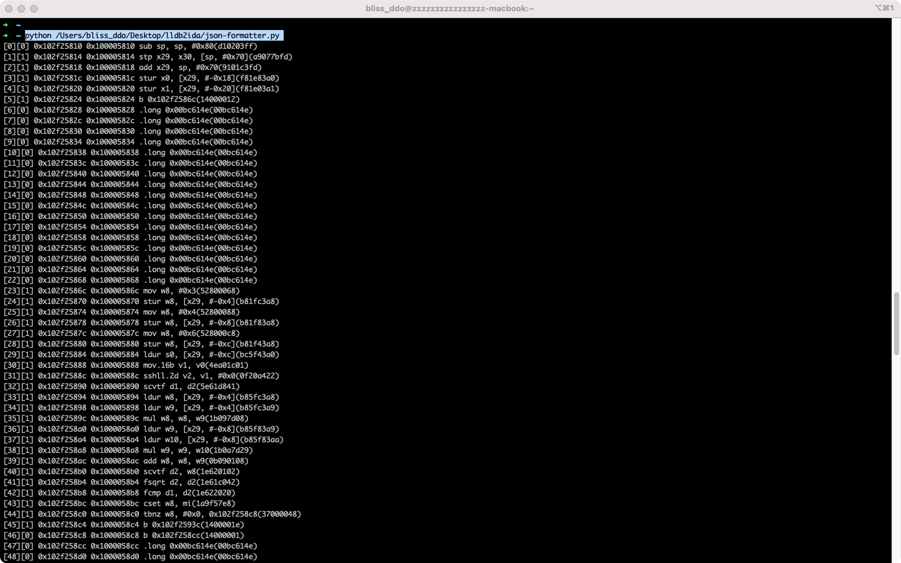

# 用一个demo来聊聊动态trace

## 这个仓库能做什么？

帮助理解动态trace的思想。仓库内的demo，可操作，可实践。

动态trace核心思想：

动态记录一个函数内每一条指令的执行中产生的信息，并导入IDA，用来弥补IDA等静态分析工具的不足。

## 反编译看一下

- 先clone仓库，把hellolldb.app拖到IDA里分析一下。这个hellolldb.app是我自己造的demo。demo只有按钮，点击按钮之后会触发回调onBtnClick,回调里会弹个窗，并打印一行log。我手动对demo加了一些常见的混淆。下面的截图是混淆后的代码。自己逆一下自己的demo，IDA7.0 : 

  - Function Window里看不到函数名
  - 有DCQ
  - 有br切开整个函数的body
  - 整个函数(开头结尾)没被识别，无法F5

  


## 开始动态执行：

把helllolldb.app拖到MonkeyDev里，并且在onBtnClick下个断点。点击按钮，断点断住。

把lldb-trace里的导出json的路径改成你自己的:

```
26	filename = "/Users/bliss_ddo/Desktop/%d.json"%(time.time())
```

输入script 进入交互式脚本执行环境:

```
(lldb)script
```

在交互式环境导入lldb-trace.py

```
exec(open('/Users/bliss_ddo/Desktop/lldb2ida/lldb-trace.py').read())
```

执行脚本里的函数:

```
 Tracer().tracehere(True)
```


回车，执行，得到一份运行时的json。把json改个名，叫1.json


这个脚本做了什么？

- 记录函数的开头和结尾(后续在IDA里修复函数)
- 对每一行指令打个断点，并注册断点hit的回调。
  - 记录每一行指令的内存地址，值
  - 对于br指令，记录读取br后寄存器的值，用来修复成b指令
  - 记录断点hit的count，后续修复用。
- 找到当前断点的上级，也就是lr寄存器的值，在这个地方断点并注册回调，用来标记trace结束。trace结束时，把上述的运行记录导出到一份json里。


## 看一下json里的内容

用json-formatter.py来看一下这个json里的内容，终端运行

```
python /Users/bliss_ddo/Desktop/lldb2ida/json-formatter.py
```



第一列，index，

第二列，激发次数

第三列，带aslr的地址

第四列，不带aslr的地址

第五列，汇编助记词和操作数

第六列，内存里的值

第n列，任何逆向trace的值，脚本自己扩展


## 把这个JSON搞到IDA里

打开IDA,在下方的交互式环境里输入

```
 exec(open('/Users/bliss_ddo/Desktop/lldb2ida/ida-fix.py').read())
```


脚本做了什么事？看脚本的最后几行。

```
fixer = Fixer("/Users/bliss_ddo/Desktop/1.json") //读取动态trace的json
fixer.processJSON() //解析一下
fixer.fix_function_range() // 调用idc的函数，重新确定函数开始和结尾
fixer.fix_br() // 判断br的寄存器值是否落在函数内，如果在函数内，将其修复成b (reg-pc) b的计算规则见下文
fixer.fix_unknow_as_nop() // 讲DCQ里无法被mark as code的变成nop
# fixer.fix_unexec_as_nop() // 这句比较危险，把没被执行的代码变成nop，可以去掉虚假控制流，当然也有可能误杀。在逆一些签名加密之类的比较管用。这里就认为动态执行的路径，就是最最最正确的路径
# fixer.restore() //出错的时候的时候把IDA恢复回去。。。
```

记得把patch应用到原来的二进制里

```
IDA菜单-->Edit-->Patch program --> Apply.......
```

再次再MonkeyDev里运行一下修复后的二进制，ok能用。


## 后记

也就仅仅是用手头工具做了个demo。

这个过程中调研了很多的工具，也涨了很多姿势，工具没有十分趁手的，就自己做了个小demo。

道阻且长，一起加油。

